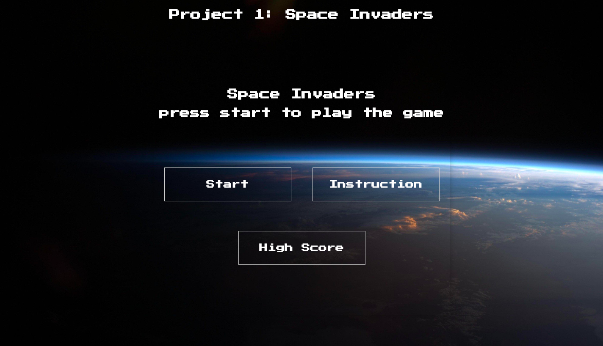
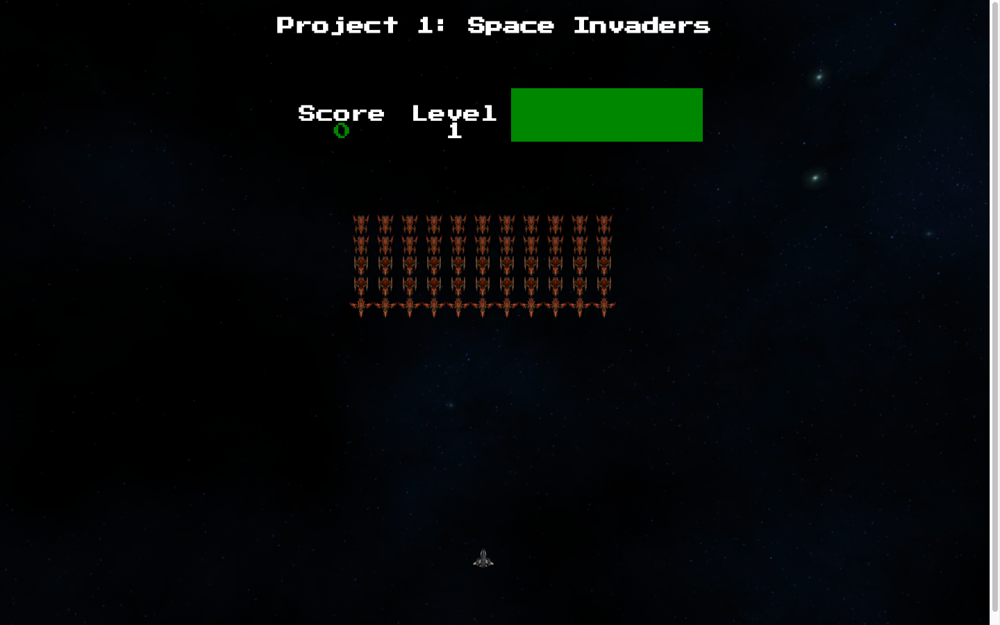
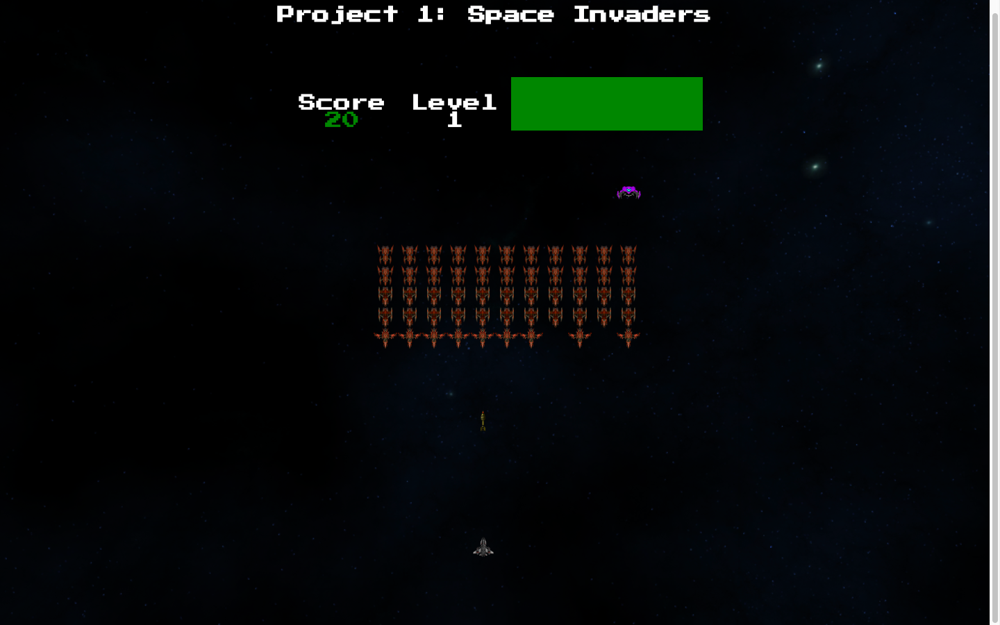
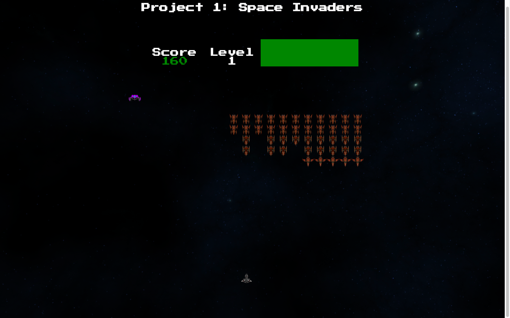
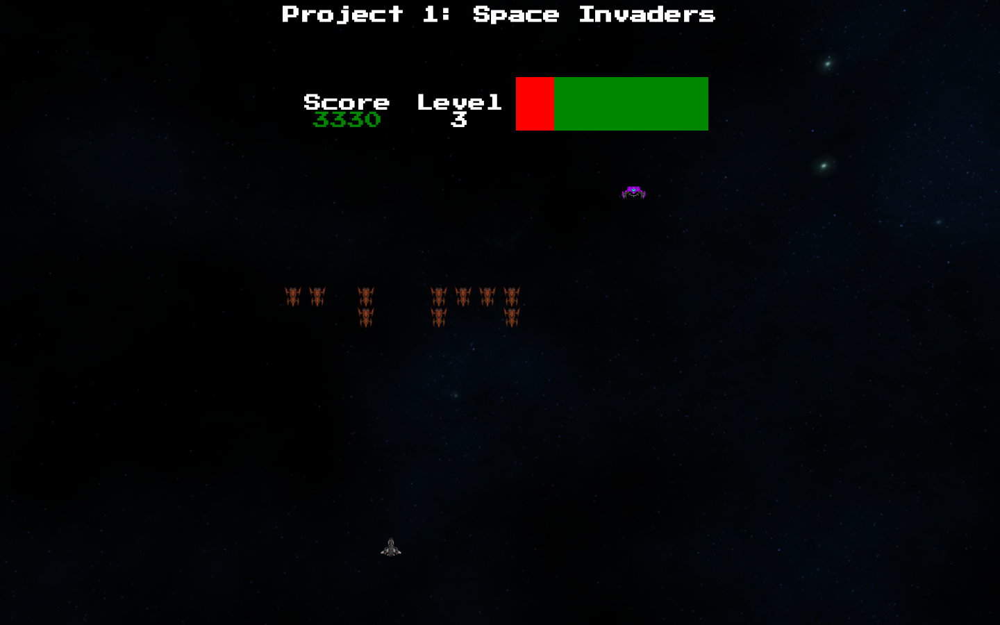
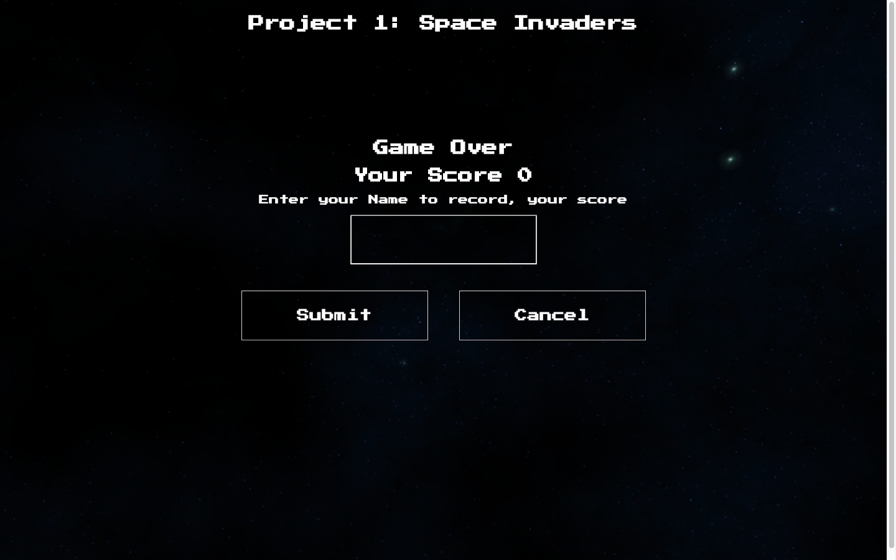
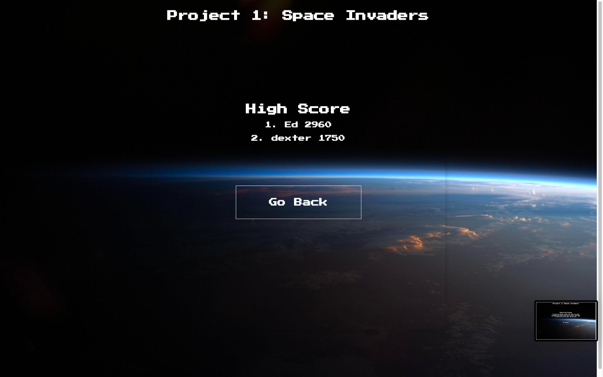

# WDI Project 1
# General Assembly Project 1: Space Invaders

## Time frame
9 Days

You can find a hosted version here: https://siddant.github.io/project-01/

## Technology Used
* Javascript (ES6)
* Css
* HTML5
* GitHub

## Game Summary

Space Invaders is a classic arcade game from the 80s. The player aims to shoot an invading alien armada, before it reaches the planet's surface using a mounted gun turret.

The player can only move left or right. The aliens also move from left to right, and also down each time the reach the side of the screen. The aliens also periodically drop bombs towards the player.

Once the player has destroyed a wave of aliens, the game starts again. The aim is to achieve the highest score possible before either being destroyed by the aliens, or allowing them to reach the planet's surface.

## Game Controls:
* Use the ← and → to move left or right.
* Use the spacebar to shoot the invading aliens

# Game Instructions
1. The game start with  a start screen displaying the game title, start game button, instruction button and a High Score button

2. Upon pressing the start button, the game will begin. The game will display the player ship at the bottom of the screen and the enemy ships which is located at the top of the screen. The ship can be controlled by using the ← or → key. Space bar to shoot missile.The game will also display you score points, the game current level and your health bar.

3. By pressing the space bar the player has the ability to shoot the alien ship and shop the waves of alien from invading the earth.

4. Points are collected by shooting down the aliens ship, the points depends on the ship the player has shoot down.The aliens ship at the 2 top row is worth 30 points each, the middle 2 row is worth 20 points each, the last row is worth 10 points and the mysterious ship that fly past the top is a mystery.

 5. If the player is able to clear the current waves of enemies, it will be replaced by another waves of enemies ship and the level increase. As the player start progress though out the level each waves of enemies start getting difficult to beat as they get faster.

 

 6. The enemies has the ability to fire, so player have to avoid the enemies lazers. If the player do get hit by the enemies lazers, their heath bar will start decreasing. The player health bar is located at the top right corner. If the player health runs out the game will end. The game will also end if the approaching enemies do managed to get to the bottom of the screen. At the end of the game the player do have the options to record their score.

 

 7. The main aim of the game is to get as many points as possible. The top 10 recorded high score will be displayed. This option is located at the start menu.

 

## Process

## Challenges

The movement of large groups of aliens in formation similar to the original game was a huge issue. As each of the alien ship was an individual object and trying to move them individually caused a lot of ship to move out of synch or started overlapping on top of another. A lot of trial and error to the ship movement function had to be made in-order to make the movement look similar to the original game.

The game involves a lot of different time based methods and functions which gets invoked at the same time, so it was a challenge to make sure that the game mechanics such as the collision detection work properly. Since the laser and the movement of the alien ship occur at different milliseconds, it was difficult to make sure that the correct ship was hit and was removed properly. Also the laser collision physics does not work properly if the aliens laser and the players laser were to be at the same gride then they will ignore each other and move through them. Therefore the game collision physics need to be worked on further.

Time management of the project was a huge challenge, I started developing the game before making any kind of plans. This caused a lot of issue during the development process, as a lot of time was spent towards thinking about questing such as what the game should look like or what kind of features should the game have.

## Wins
By invested time in the stying the game, particularly adding few design such as adding background images made the game look and feel like a professional game.

The use of class constructor function in the project was really helpful as it made the code reusable and manageable. The code can be refactored further allowing it to be reused in a different game project, typically a vertically scrolling shooter where the action is viewed from above and scrolls up the screen. Similar to the game below on the link:

https://en.wikipedia.org/wiki/Category:Vertically_scrolling_shooters

There were few bugs in the code that was difficult to fix particularly understanding the meaning behind them, so researching these bugs and finding the solution was a satisfying moment overall the project. Also I am pleased to see an improvement in my problem solving skills.

## Future Features

If I had more time then, I would like to make the game design more responsive. To make the game playable on any device such as mobile, table or larger screen. I would also like to included a game control plane which would appear for touchscreen device.

I would have put more animation or sound to make the game come more alive. I would have also like to make the background image to move every few seconds to get the impression that the player is moving on the space.

The movement of the alien ship could be improved, as they move similar to the original game (left to right and go down if they reach the wall). Their movement could be dynamically improved some ship moving right, some moving left some ship coming down and some ship spawning at random location. different types of waves of alien, different images for aliens ship as the player start progressing through out the level. Different type of object could be implemented such as an astroid or a satellite moving towards the player, which they has to avoid.
